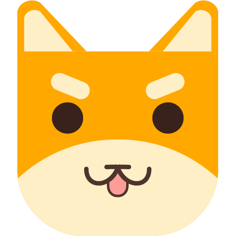

    

  

# Dogif
A powerful and easy to use screen recording tool

## Contents  
- [Installation](#Installation)
- [Usage](#Usage)
    - [Record](#Record)
        - [Hotkey]
    - [Preview]
    - [GetResult]
    - [HistoryFile]
    - [ProgressBar]
    - [KeyboardAndMouse]
    - [ImageFormat]
    - 
- [Dependency](#Dependency)
- [Compile](#Compile)
- [License](#License)

## Installation  
This is two way to install Dogif  
1. Download the installer and run it  
2. Download the zip archive, extract it to the specified directory.  

## Usage
